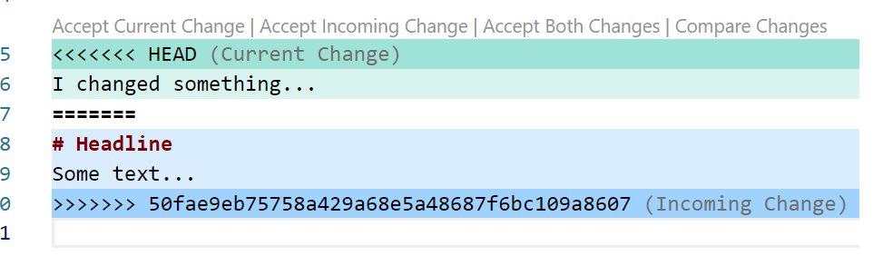

# Kodeks rada:

1. Klonirati glavni repozitorij na lokalno računalo  
    **_git clone https://github.com/vdavid033/iooa-2022.git_**

1. Bitno: Na lokalnom repozitoriju izmjene se rade na dodijeljenoj feature grani.  
    Popis grana na lokalnom repozitoriju dobije se naredbom:  
    
    **_git branch_**  
    
    Pozicioniranje na željenu feature granu (npr. feature1):  
    
    **_git switch feature1_**  
    ili  
    **_git checkout feature1_**  
    
    Nakon željenih izmjena u folderu, radi se stavljanje datoteka u staged stanje (* zamjenjuje sve nazive datoteka, ali možete i staviti nazive datoteka):  
    
    **_git add *_**  
    
    Potvrda izmjena za lokalni repozitorij (U opis izmjena stavite opis onoga što ste napravili): 

    **_git commit -m "Opis izmjena"_**  

1. **Rad u grupi** podrazumijeva da svi članovi grupe rade na izmjenama.  
Kad napravite neku funkcionalnost, želite je objaviti na udaljenom repozitoriju (push), tako da bude postavljena prvo na feature granu, a zatim u development granu udaljenog GitHub repozitorija.  

Koraci:  

* Prvo ćete lokalno dohvatiti sve izmjene koje su u međuvremenu napravljene na udaljenom repozitoriju (pull) na development i feature granama.  

    Dohvat grana development i feature1 s udaljenog repozitorija:  
    
    **_git pull development development_**  
    
    **_git pull feature1 feature1_**  

    Pozicionirajte se na feature granu:
    
    **_git switch feature_**  

* Zatim ćete lokalno na feature grani spojiti vlastite izmjene s dohvaćenim:  

    **_git add *_**  
    
    I potvrdite izmjene:    
    
    **_git commit -m "Opis novih izmjena"**  

    Ukoliko se pojave konflikti:  
    
      

    Datoteke mogu biti izmjenjene s vaše strane ili od nekog drugog člana tima ili oboje. U prva dva slučaja možete pregledati i prihvatiti izmjene. Ukoliko 
    na datotekama na kojima ste i vi radili postoji izmjena/dodatak koji je netko drugi radio, pažljivo provjerite koje su izmjene i utječu li na ono što ste 
    sami radili, te integrirajte izmjene u programski kod. 

    Nakon rješavanja konflikta, ponovno postavite datoteke u staged stanje:  
    
    **_git add *_**  
    
    I potvrdite izmjene:    

    **_git commit -m "Opis novih izmjena"**  

* Obzirom da postoji development grana na lokalnom repozitoriju, koja sadrži zadnje izmjene, te izmjene se mogu ubaciti u feature granu. Treba se pozicionirati na feature granu i spojiti na nju izmjene u developmentu 
    **_git merge development_**  

* Nakon toga se ponavlja postupak dodavanja (add) i potvrđivanja izmjeni (commit), te rješavanja konflikata po potrebi.

Redovito bi trebalo raditi dohvat izmjena iz development grane iz udaljenog repozitorija u lokalni. Također se lokalno spajaju izmjene iz development grane s feature granom kako bi se na udaljenom repozitoriju naišlo na što manje konflikata nakon prebacivanja programskog koda na udaljeni repozitorij.  

1. Postavljanje svih izmjena na udaljeni repozitorij:  

    **_git push origin feature1_**  

1. Radi se na feature granama. Potrebno je izbjegavati rad na development ili main granama.  

1. Na udaljenom repozitoriju sad se nalaze željene izmjene na feature grani koja rješava jednu funkcionalnost. Za postaviti tu funkcionalnost u development granu, radi se pull request od feature grane prema development grani, te traži code review od vlasnika repozitorija. Ovaj dio odrađuje se na udaljenom repozitoriju.  
